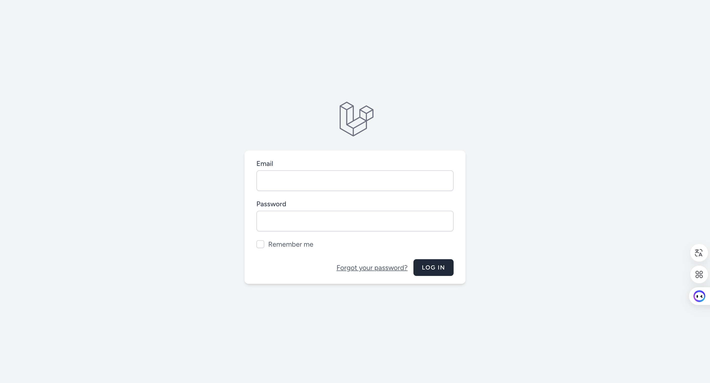
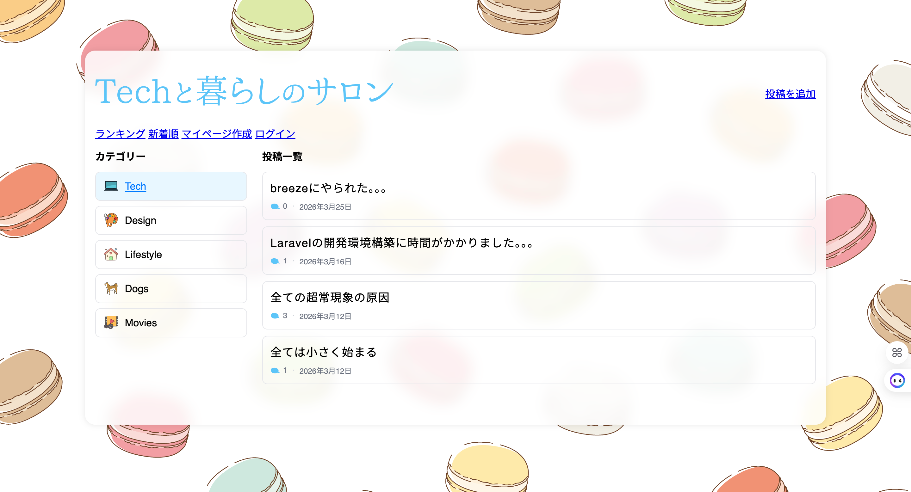
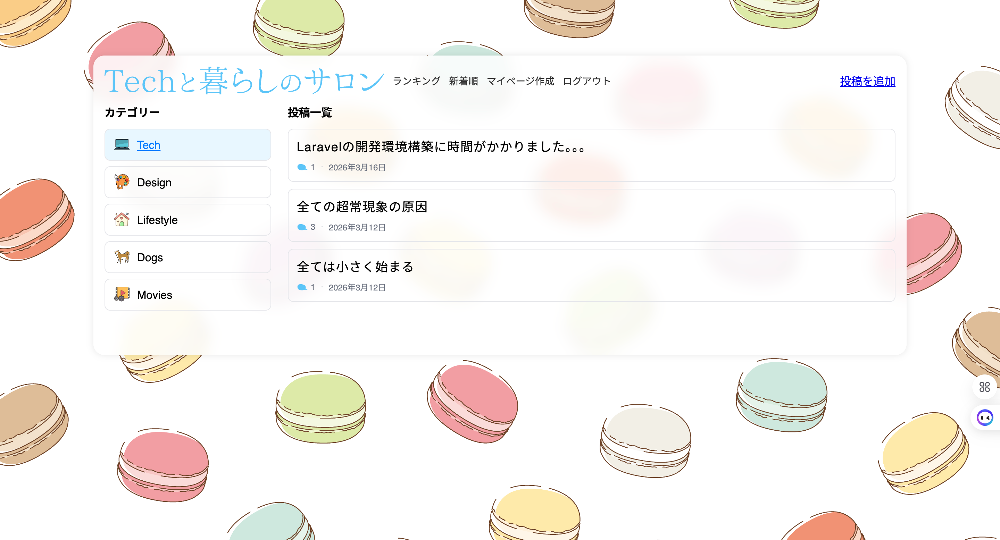
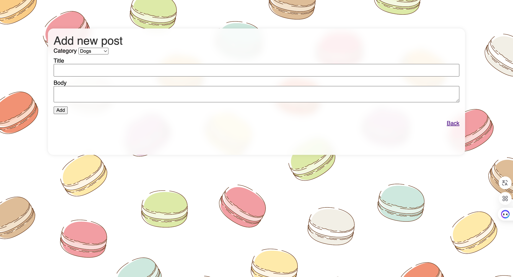
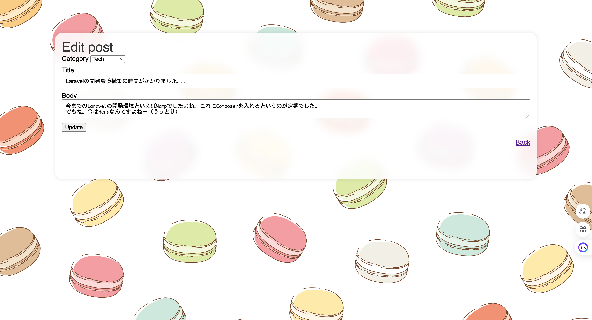

# life-tech-community

A Laravel-based bulletin board application for sharing ideas about life, work, and technology.  
つくる人の、しごとと暮らしをつなぐ場所。

---

## 🔗 URL

※現在ローカル環境でのみ動作

---

## 🖼️ サービス画面

### ログイン

### トップページ

### 投稿詳細ページ

### 投稿作成ページ

### 投稿編集ページ

---

## 🛠️ 使用技術

- PHP (Laravel)
- Laravel Breeze（認証機能）
- HTML / CSS
- MySQL

---

## ✨ 主な機能

- ユーザー登録 / ログイン機能（Laravel Breeze）
- 投稿の作成・編集・削除（CRUD）
- 投稿一覧表示 / 詳細表示

---

## 🎨 工夫した点

- クリエイティブな仕事をしている女性が、安心して楽しく投稿できるデザイン設計
- 視線の流れを意識したUIレイアウト
- パステルカラーと柔らかいフォントで世界観を統一

---

## 🚀 今後の改善

- 投稿の並び替え（新着順・人気順）
- ログアウト機能の実装 -> 実装済み
- ランキング機能の追加
- レスポンシブ対応の強化
- UI / UX のさらなる改善
- ログインページのブラッシュアップ
